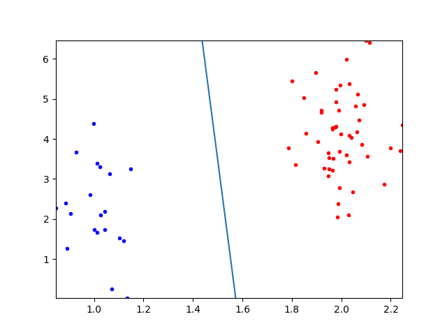

# Homework 2

Due Feb 26, 2023, Sunday, 11:59pm
Central time 

## How to view this in nice PDF
`pandoc -s hw2.md -o hw2.pdf` 

A precompiled PDF is [here](https://www.dropbox.com/s/bo4r8c94run4jyn/hw2.pdf?dl=0). 

## Theory [1pt each]

Unless otherwise stated, 

   * all 1-D vectors, such as $x$ and $w$ below, are column vectors by default.
   * the classification problem is binary. 
   * a lower case letter variable is a scalar or vector, where a upper case letter (in any font) is a matrix.

1. Given a sample with feature vector $x=[1.1, 2.2, 3.3]^T$,  what is its  corresponding augmented feature vector? 

2. If the weight vector of a linear classifier is $w=[1, 0, 1, 0]^T$, and we define that a sample belongs to class $+1$ if $w^Tx>0$ and $-1$ if $w^Tx<0$ where $x$ is the augmented feature vector of the sample, what is the class of the sample? 

3. What is the difference between hyperparameters and parameters? Which one is learned from data? Which one is set by the user?

4. Neither the validation set nor the test set is used in training. So what is the purpose to distinguish the two? 

## Before you start the programming part 
You are strongly encouraged to review the following materials that were discussed in class before you start the programming part.
* [gradient descent demo](https://github.com/forrestbao/MLClass/blob/master/2_Linear_Classifiers/gradient_descent_linear_classifier.ipynb) You will not be able to run all code in this demo because one function used here is the homework problem.
* [Numpy introduction](https://github.com/forrestbao/MLClass/blob/master/2_Linear_Classifiers/numpy.ipynb)
* [snippets of code to find a linear decision hyperplane via zero-gradient](https://github.com/forrestbao/MLClass/blob/master/2_Linear_Classifiers/2_Linear_Classifiers.ipynb)

## Programming

A template [`hw2.py`](https://github.com/forrestbao/MLClass/blob/master/2_Linear_Classifiers/hw2.py) is provided. Insert your code between the lines  `# your code below` and `# your code above`. A helper function `generate_data` is included in `hw2.py` to generate data. The test cases are given in docstring in `hw2.py`. To test whether your program works properly, you may take advantage of the `doctest` code in it. Information on `doctest` is given [here](https://docs.python.org/3/library/doctest.html).

6. [2pts] 2-D scatter plots and line plots. 

    This problem is a precursor for the two problems below. In the next two problems, you will compute a decision hyperplane (2D, so just a line) separating data of two classes, and visualize it along with the data like blow: 
    
    { width=500px }
    
    The function for visualization is to be done in this problem and to be called in the next two problems. 

    Please name the function as `plot_data_hyperplane`. The inputs/arguments of the function shall be: 

    * `X`: a 2-D numpy array such that `X[i]`, which is 1-D numpy array, corresponds to the i-th sample's feature vector (not augmented). The shape of `X[i]` is 1-by-2. Note this `X` is NOT augmented nor normalized. (See programming hints below.)
    * `y`: a 1-D numpy array such that `y[i]`, which is a scalar $\in[+1, -1]$, is the label of the i-th sample. 
    * `w`: the weight vector of the classifier, where the 1st element corresponds to the 1st dimension of a feature vector, the 2nd element corresponds to the 2nd dimension of a feature vector, and the last term is the bias. 
    * `filename`: a string ending in `.png` or `.pdf`, the path to save the plot into a PNG or PDF file.                                

    The function shall have NO RETURNs. 

    **Helper information and specifications**: 

    * How to plot in Python: Use the `plot` function provided by the Python module `matplotlib`. [See here](https://matplotlib.org/3.3.4/api/_as_gen/matplotlib.pyplot.plot.html#matplotlib.pyplot.plot) or re-watch the demo video in class. 

    * How to visualize samples in scatter plot: For each sample `X[i]`, which is a 1-by-2 vector, use its first value as the horizontal coordinate and the second value as the vertical coordinate, e.g., `plot(X[i][0], X[i][1])` -- however, it is very inefficient to loop over samples to plot one each time. A more efficient way is to extract the horizontal and vertical coordinates of many samples into two vector and feed them to `plot` function once, e.g., `plot(A, B)`. A sample `X[i]`'s class is given in corresponding `y[i]`.  Use red circles (e.g., `plot(x,y, 'ro')`) for class +1 and blue circles (e.g., `plot(x,y,'bo')`) for class -1. 
    
    * How to separate samples of two classes: 

      Make use of [NumPy's index arrays](https://numpy.org/doc/stable/user/basics.indexing.html#index-arrays)

      ```
      X1 = X[y == +1] # samples of class +1
      X2 = X[y == -1] # samples of class -1
      ```
    * How to plot the hyperplane: First compute the coordinates of two points on the hyperplane (see below). The call `plot` in line style (e.g., `plot(x,y, 'k-')`) to produce a line going through the two points. Use a black line. 

    * Given the equation of a line $\mathbf{w}^T\mathbf{x}=0$, how to compute two points through which we can visualize the line? 
      Let the horizontal coordinates of the two points be 
      ```
      x_ticks = numpy.array([numpy.min(X[:,0]), numpy.max(X[:,0])])
      ```
      then their vertical coordinates are 
      ```
      y_ticks = -1*(x_ticks * w[0] +w[2])/w[1]
      ```
      Finally, just plot
      ```
      matplotlib.pyplot.plot(x_ticks, y_ticks)
      ```
    * What about other styles of plots? For all other objects and properties (e.g., line width, line color, marker size, marker border color, etc.), use default settings. Do NOT add legends, title, or labels for axis. Just the circles and the line. 
    * **Be sure that the plot range does not go beyond the sample range**. To do that, use `xlim` and `ylim` of matplotlib to set: 

      ```
      matplotlib.pyplot.xlim(numpy.min(X[:,0]), numpy.max(X[:,0]))
      matplotlib.pyplot.ylim(numpy.min(X[:,1]), numpy.max(X[:,1]))
      ```
    * How to save a plot to a file? 
      ```
      matplotlib.pyplot.savefig(filename)
      ```
    * Be sure to include the line below at the end of the `plot_data_hyperplane` function to avoid different plots overlay each other.     
      ```
      matplotlib.pyplot.close('all') # it is important to always clear the plot
      ```

      
7. [2pts] The demo [`2_Linear_classifiers.ipynb`](./2_Linear_classifiers.ipynb) provides snippets of code to achieve a linear classifier using the minimization of the sum of the squared errors, and the visualization of the classifier. Now please define a function `learn_and_visual_mse` that trains a linear classifier (i.e., compute $\mathbf{w} = (\mathbb{X}^T\mathbb{X})^{-1}\mathbb{X}^T \mathbf{y}$) and visualizes it alone with the training samples. 

    Inputs/arguments: 

    * `X`: a 2-D numpy array such that `X[i]`, which is 1-D numpy array, corresponds to the i-th sample's feature vector (not augmented). The shape of `X[i]` is 1-by-2. Note this `X` is NOT augmented nor normalized. (See programming hints below.)
    * `y`: a 1-D numpy array such that `y[i]`, which is a scalar $\in[+1, -1]$, is the label of the i-th sample. 
    * `filename`: a string ending in `.png` or `.pdf`, the path to save the plot into a PNG or PDF file. 

    Output/return: 

    * `w`: the weight vector of the classifier, where the 1st element corresponds to the 1st dimension of a feature vector, the 2nd element corresponds to the 2nd dimension of a feature vector, and the last term is the bias. 

8. [2pts, **bonus**] Redo the function above using Fisher's linear discriminant. Save the function as `learn_and_visual_fisher`. 

   Note that on the slides, when discussing Fisher's, the $\mathbf{w}$ does not contain the bias. But when returning $\mathbf{w}$ here, please add the bias as the last element.


## How to submit 
For theory part, submit as a PDF file. For programming part, work on the template `hw2.py` and submit it. 

## Programming hints
- Note in programming assignment, each sample is a row in `X` instead of a column vector as in the math in slides. 
- The argument `X` in all three functions that you will define is NOT augmented nor normalized. 
  ```
  X = numpy.array([[1,2,3], # class +1
                  [4,5,6],  # class -1
                  [7,8,9]]) # class +1
  y = numpy.array([1,-1,1])
  ```
  In Problem 7, you need to convert `X` into the augmented ~~and normalized~~ version first. 
  In Problem 8, you do not need to. 
  

## Additional programming hints for Fisher's
- How to know the size of a class $|C_i|$? 

  There are many ways, you could measure the number of rows for samples in the 
  class like `X1.shape[0]`, or you could measure the number of elements in `y` 
  equal to $i$ like `numpy.sum(y==1)`.
- How to compute $\mathbf{m}_i$? 

  Use Class 1 as example: 
  ```
  m1 = numpy.mean(X1, axis=0) 
  ```
  If using `axis=1`, then it computes mean per row instead of mean per column. 

- How to compute $\mathbf{S}_i$? 
  Let's first see how to transform the sum of dot products into matrix operation. 
  $\mathbf{m}_1=[4,5,6]^T$. 
  Using class 1 as the example, by the definition, 
  \begin{align}
  \mathbf{S}_1 & =  
    \left [
      \begin{pmatrix}
      1 \\ 2 \\ 3
      \end{pmatrix} 
            - 
%      \overbrace{
        \begin{pmatrix}
        4 \\ 5 \\ 6
        \end{pmatrix} 
%       }^{\mathbf{m}_1}
    \right ]  
%    \overbrace{
      \left [
        \begin{pmatrix}
        1 \\ 2 \\ 3
        \end{pmatrix} 
              - 
        \begin{pmatrix}
        4 \\ 5 \\ 6
        \end{pmatrix}     
      \right]^T
%    }^{\text{itself transposed}}
  +
    \left [
      \begin{pmatrix}
      7 \\ 8 \\ 9
      \end{pmatrix} 
            - 
      \begin{pmatrix}
      4 \\ 5 \\ 6
      \end{pmatrix} 
    \right ]  
    \left [
      \begin{pmatrix}
      7 \\ 8 \\ 9
      \end{pmatrix} 
            - 
      \begin{pmatrix}
      4 \\ 5 \\ 6
      \end{pmatrix} 
    \right]^T  \\           % end of first step
  & =  
  \left [
    \begin{pmatrix}
      1 \\ 2 \\ 3
      \end{pmatrix} 
            - 
      \begin{pmatrix}
      4 \\ 5 \\ 6
      \end{pmatrix} 
    , 
      \begin{pmatrix}
      7 \\ 8 \\ 9
      \end{pmatrix} 
            - 
      \begin{pmatrix}
      4 \\ 5 \\ 6
      \end{pmatrix} 
    \right ]
    \left [
    \begin{pmatrix}
      1 \\ 2 \\ 3
      \end{pmatrix} 
            - 
      \begin{pmatrix}
      4 \\ 5 \\ 6
      \end{pmatrix} 
    , 
      \begin{pmatrix}
      7 \\ 8 \\ 9
      \end{pmatrix} 
            - 
      \begin{pmatrix}
      4 \\ 5 \\ 6
      \end{pmatrix} 
    \right]^T  \\           % end of second step
  & =  
    \left [
      \begin{pmatrix}
      1 & 7\\ 2 & 8 \\ 3 & 9
      \end{pmatrix} 
            - 
      \begin{pmatrix}
      4 & 4 \\ 5 & 5 \\ 6 & 6
      \end{pmatrix} 
    \right ]
    \left [ 
      \begin{pmatrix}
      1 & 7\\ 2 & 8 \\ 3 & 9
      \end{pmatrix} 
            - 
      \begin{pmatrix}
      4 & 4 \\ 5 & 5 \\ 6 & 6
      \end{pmatrix}
    \right ]^T \\  % end of third step 
  & = 
      \begin{pmatrix}
      1-4 & 7-4\\ 2-5 & 8-5 \\ 3-6 & 9-6
      \end{pmatrix} 
      \begin{pmatrix}
      1-4 & 7-4\\ 2-5 & 8-5 \\ 3-6 & 9-6
      \end{pmatrix}^T  \\
  & = 
      \begin{pmatrix}
      18 & 18 & 18 \\
      18 & 18 & 18 \\
      18 & 18 & 18 \\
      \end{pmatrix}
    \end{align}

  
  <!-- First, duplicate $\mathbf{m}_1$ is a matrix $M:=$
  First subtract $\mathbf{m}_1$ from each row of $X_{C_1}$ resulting in a matrix 
  $(\mathbf{X_{}})$ -->
  

  From this example (particularly Eq.~(3)) we can see that, 
  $$\mathbf{S}_i = \sum\limits_{\mathbf{x}\in C_i}(\mathbf{x - m}_i) (\mathbf{x - m}_i)^T$$ can be rewritten into the multiplication between two matrixes: 
  $$\underbrace{\mathbf{S}_i}_{d\times d}
   = \underbrace{\mathbf{(X_i-M_i)}}_{d\times |C_i|}
     \mathbf{(X_i-M_i)}^T$$ where 
  $\mathbf{X}_i = \begin{pmatrix}
    \vertbar     &            & \vertbar           &          & \vertbar  \\
    \mathbf{x}_{i_1} & \cdots &  \mathbf{x}_{i_j} & \cdots   & \mathbf{x}_{i_{|C_i|}} \\
    \vertbar     &            & \vertbar           &          & \vertbar 
  \end{pmatrix}$
  comprises of vertically stacked $|C_i|$ samples $[\mathbf{x}_{i_1}, \mathbf{x}_{i_2}, \cdots, \mathbf{x}_{i_j}, \mathbf{x}_{i_{|C_i|}}]$ in class $i$ (a sample per column) and  $\mathbf{M}_i = 
  \underbrace{
    \begin{pmatrix}
      \vertbar     &        & \vertbar      & \vertbar & \vertbar \\
      \mathbf{m}_i & \cdots &  \mathbf{m}_i & \cdots   & \mathbf{m}_i \\
      \vertbar     &        & \vertbar      & \vertbar & \vertbar 
    \end{pmatrix}
  }_{|C_i| \text{ columns}}$
  duplicates the mean vector $\mathbf{m}_i$ by $|C_i|$ times vertically, and $d$ is the number of features. 
  
- How to programmingly construct the "duplication" matrix $\mathbf{M_i}$? 

  The example below duplicates a 1-D vector row-wisely. 
  It's not the exact solution but shall give you the idea.

  ```python3
  >>> m1=numpy.array([4,5,6])
  >>> numpy.array([m1]*2)
  array([[4, 5, 6],
        [4, 5, 6]])
  ```

  Alternatively, Numpy allows subtracting a vector from a 2D array **in the direction of the vector**. 
  So you won't need to duplicate $\mathbf{m}_i$ into $\mathbf{M}_i$. 
  ```python3
  >>> X=numpy.array([[1,2,3],\
  ...                [4,5,6]])
  >>> m1=numpy.array([4,5,6])
  >>> X-m1   # subtracting [1,2,3] from each subarray of X, element to element
  array([[-3, -3, -3],
        [ 0,  0,  0]])
  >>> m2=numpy.array([[4],\
  ...                 [5]])
  >>> X-m2   # subtracting 4 from each element in the first subarray of X, and 
  >>>        # then 5 in the second subarray
  array([[-3, -2, -1],
        [-1,  0,  1]])
  ```
