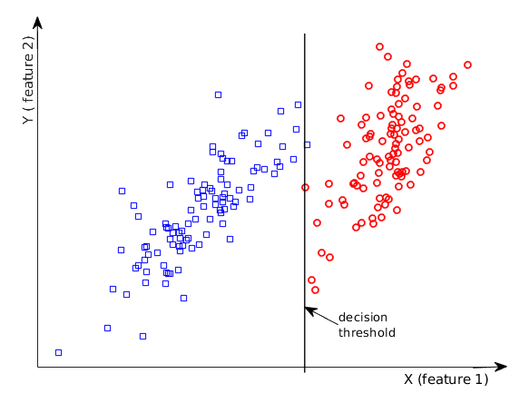
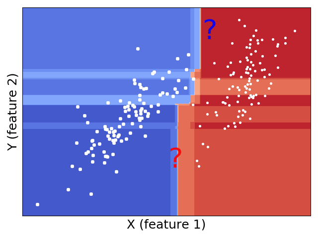

# Decision Trees (DTs)

{width=80%}

- A binary tree. Each node is a Boolean comparison on a feature. 
- Each node **split** into two branches. Continues to one of the two. 
- Root node: the beginning. Leaf node: the decision. 
- May not visit all features. May visit a feature more than once. 
- What will be the class for a sample with the following feature values? 
CPR= 2.7, creatinine = 50

# Constructing a DT(-based classifier)
:::::::::::::: columns
::: {.column width="50%"}
{width=100%}
:::

::: {.column width="50%"}
- Two things need to be determined at each node: feature and threshold. 
- Thresholds can be values of training samples on a feature. 
- Exhaustive search. Complexity: O(NM), $N$: number of features, $M$: number of samples. 
:::
::::::::::::::

- Intuition: Each node cuts the plane into two halves. It's better to have less mixture of two classes on each half. 
- Given a Boolean condition $S$, Gini impurity is $g(S) =  \sum_{c=\pm1} 
Pr(class=c| S) \cdot (1-Pr(class=c| S)) = 1 - \sum_{c=\pm1} Pr^2(class=c| S)$. If all samples belong to one class, then $g(S)=0$ thus least impure and hence most pure. 

# Constructing a DT(-based classifier) (cond.)

:::::::::::::: columns
::: {.column width="40%"}
{width=110%}
:::

::: {.column width="60%"}
- Consider impurity on both ends, i.e., $F>T$ and $F\le T$. Expectation of impurity: $E(F, T) = P(F>T)g(F>T) + P(F\le T)g(F\le T)$
- Another way to determine impurity is **entropy**. 
:::
::::::::::::::

- When to stop the split? Depends on 3 **hyperparameters**: the maximum height of the tree, the minimum Gini impurity, and the minimum sample pool
- [A good tutorial by Victor Zhou](https://victorzhou.com/blog/gini-impurity/)
- How to use it for regression? [Sklearn example](https://scikit-learn.org/stable/modules/tree.html)

# Random Forests

:::::::::::::: columns
::: {.column width="60%"}
{width=110%}
:::

::: {.column width="50%"}
-  a collection (technically an ​ensemble​) of DTs that share the same set of hyperparameters. 
- Member DTs are trained independently using random samples and random features. 
- Final decision is the majority vote of all member DTs. 
:::
::::::::::::::

