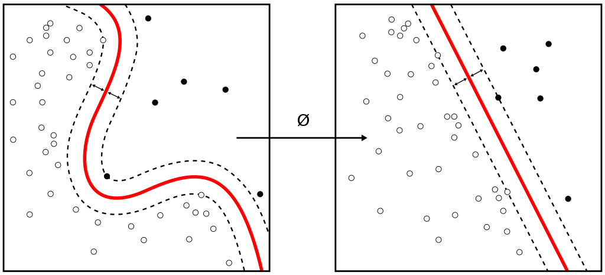
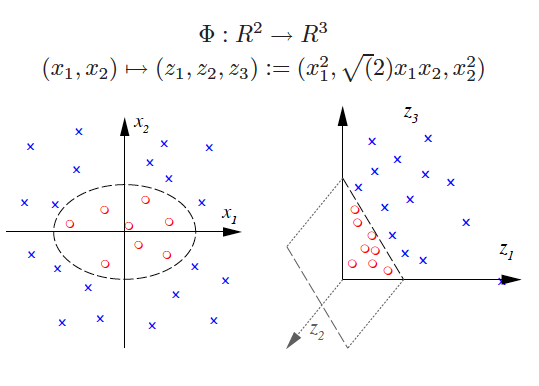

# Agenda

- Perceptron algorithm -- Its model differs from SVMs a lot. But it shows that the weight vector is a linear combination of some samples -- it resembles SVMs in that sense. 

- The intuition of SVMs: separate similar samples of both classes apart as far as possible. 

- Deriving the primal form of SVMs, and solving it in KKT conditions

- Dual forms of SVMs and the kernel tricks

- Soft-margin SVMs

# All samples are equal. But some samplers are equaler. 

- Let's first see a demo of a linear classifier for linearly separable cases. Pay attention to the prediction outcome. 
- Think about the error-based loss function for a classifier: $\sum_i (\hat{y} - y )^2$ where $y$ is the ground truth label and $\hat(y)$ is the prediction. 
- If $y=+1$ and $\hat{y} = +1.5$, should the error be 0.25 or 0 (because properly classified)? 

# The perceptron algorithm

-   Recall earlier that a sample $(\mathbf{x}_i, y_i)$ is correctly
    classified if $\mathbf{w}^T \mathbf{x}_i y_i > 0$ .

-   Let's define a new cost function to be minimized:
    $J(\mathbf{w}) = \sum\limits_{x_i \in \mathcal{M}} - \mathbf{w}^T \mathbf{x}_iy_i$
    where $\mathcal{M}$ is the set of all samples misclassified
    ($\mathbf{W}^T \mathbf{X}_i y_i < 0$).

-   Then,
    $\nabla J(\mathbf{w}) =  \sum\limits_{\mathbf{x}_i \in \mathcal{M}} - \mathbf{X}_iy_i$
    (because $\mathbf{w}$ is the coefficients.)

-   Only those misclassified matter! 

-   Batch perceptron algorithm: In each batch, computer
    $\nabla J(\mathbf{w})$ for all samples misclassified using the same
    current $\mathbf{w}$ and then update.

# Single-sample perceptron algorithm 

-   Another common type of perceptron algorithm is called single-sample
    perceptron algorithm.

-   Update $\mathbf{w}$ whenever a sample is misclassified.

    1.  Initially, $\mathbf{w}$ has arbitrary values. $k=1$.

    2.  In the $k$-th iteration, use sample $\mathbf{x}_j$ such that
        $j = k \mod n$ to update the $\mathbf{w}$ by:
        $$        \mathbf{W}_{k+1} = \begin{cases}
                                 \mathbf{W}_k + \rho \mathbf{X}_j y_j & \text{, if } \mathbf{W}_j^T \mathbf{X_j} y_j \leq 0, \text{~(wrong prediction)} \\
                                 \mathbf{W}_k  & \text{, if } \mathbf{W}_j^T \mathbf{X_j} y_j > 0 \text{~(correct classification)}
                               \end{cases}        $$
        where $\rho$ is a constant called **learning rate**.

    3.  The algorithm terminates when all samples are classified
        correctly.

-   Note that $\mathbf{x}_k$ is not necessarily the $k$-th training
    sample due to the loop.

# An example of single-sample preceptron algorithm

:::::::::::::: columns
::: {.column width="50%"}
- Feature vectors and labels: 

  - $\mathbf{x}'_1= (0, 0)^T$, $y_1=1$
  - $\mathbf{x}'_2= (0, 1)^T$, $y_2=1$
  - $\mathbf{x}'_3= (1, 0)^T$, $y_3=-1$
  - $\mathbf{x}'_4= (1, 1)^T$, $y_4=-1$

 - First, let's augment them and multiply with the labels: 
   - $\mathbf{x}_1y_1 = (0, 0, 1)^T$, 
   - $\mathbf{x}_2y_2= (0, 1,1 )^T$, 
   - $\mathbf{x}_3y_3= (-1, 0, -1)^T$
   - $\mathbf{x}_4y_4= (-1, -1, -1)^T$
:::

::: {.column width="50%"}

0. Begin our iteration. Let $\mathbf{w}_1= (0,0,0)^T$ and $\rho=1$.

1.  $\mathbf{W}_1^T \cdot \mathbf{x}_1 y_1= 
    \begin{pmatrix}
    0 & 0 & 0
    \end{pmatrix}
    \begin{pmatrix}
    0 \\
    0 \\
    1
    \end{pmatrix} = 0 \leq 0$. Need to update $\mathbf{W}$:
    $\mathbf{W}_2 = \mathbf{W}_1 + \rho \cdot \mathbf{x}_1 y_1 = 
    \begin{pmatrix}
    0 \\
    0 \\
    0
    \end{pmatrix}
    +
    \begin{pmatrix}
    0 \\
    0 \\
    1
    \end{pmatrix} = 
    \begin{pmatrix}
    0 \\
    0 \\
    1
    \end{pmatrix}$
:::
::::::::::::::

2.  $\mathbf{W}_2^T \cdot \mathbf{x}_2 y_2= 
    \begin{pmatrix}
    0 & 0 & 1
    \end{pmatrix}
    \begin{pmatrix}
    0 \\
    1 \\
    1
    \end{pmatrix} = 1 >0$. No updated need. But since $\mathbf{w}$ so far does not
    classify all samples correctly, we need to keep going. Just let
    $\mathbf{w}_3 = \mathbf{w}_2$.

# An example of preceptron algorithm (cond.)

:::::::::::::: columns
::: {.column width="50%"}

Continue in [perceptron.ipynb](./perceptron.ipynb)

14.   In the end, we have $\mathbf{W}_{14} = 
     \begin{pmatrix}
     -3 \\
     0 \\
     2
    \end{pmatrix}$, let's verify how well it works

-   $$\begin{cases}
             \mathbf{w}_{14}\cdot \mathbf{x}_1 y_1 &= 1 > 0 \\
             \mathbf{w}_{14}\cdot \mathbf{x}_2 y_2&= 1 > 0 \\
             \mathbf{w}_{14}\cdot \mathbf{x}_3 y_3&= 1 > 0 \\
             \mathbf{w}_{14}\cdot \mathbf{x}_4 y_4&= 1 > 0
             \end{cases}$$
:::

::: {.column width="50%"}

-   Mission accomplished!

-   Note that the perceptron algorithm will not *converge* unless the
    data is linearly separable.

-   What is $\mathbf{w}$ exactly? A linear composition of all training samples!

-   Do all samples contribute to $\mathbf{w}$? Not really! 

:::
::::::::::::::

# 

Now let's begin the SVM journey. 

# Getting ready for SVMs

-   Earlier our discussion used the augmented definition of linear
    binary classifier: the feature vector
    $\mathbf{x} = (x_1, \dots, x_n, 1 )^T$ and the weight vector
    $\mathbf{w} = (w_1, \dots, w_n, w_b)^T$. The hyperplane is an
    equation $\mathbf{w}^T\mathbf{x}=0$. If
    $\mathbf{w}^T \mathbf{x} > 0$, then the sample belongs to one class.
    If $\mathbf{w}^T \mathbf{x} < 0$, the other class.

-   Let's go back to the un-augmented version. Let
    $\mathbf{x} = [x_1, x_2, \dots, x_n]^T$ and
    $\mathbf{w} = [w_1, w_2, \dots, w_n]^T$. If
    $\mathbf{w}^T\mathbf{x} + w_b > 0$ then $\mathbf{x}\in C_1$. If
    $\mathbf{w}^T\mathbf{x} + w_b < 0$ then $\mathbf{x}\in C_2$. The
    equation $\mathbf{w}^T\mathbf{x} + w_b =0$ is the hyperplane, where
    $\mathbf{w}$ only determines the direction of the hyperplane. To
    build a classifier is to search for the values for $w_1, \dots, w_n$
    and $w_b$, the bias/threshold.

-   For convenience, we denote
    $g(\mathbf{x}) = \mathbf{w}^T \mathbf{x}$.

-   We have proved that $\mathbf{w}$, augmented or not, is perpendicular
    to the hyperlane.

# What is the distance from a sample $\mathbf{z}$ to the hyperplane? 

:::::::::::::: columns
::: {.column width="35%"}

{width="110%"}
::: 

::: {.column width="65%"}
1.   Let the point on the hyperplane closest to $\mathbf{z}$ be $\mathbf{x}$. Define
    $\mathbf{z} = \mathbf{x} + \mathbf{y}$.

2.   Because both $\mathbf{y}$ and $\mathbf{w}$ are perpendicular to the
    hyperplane, we can rewrite
    $\mathbf{y} = v \frac{\mathbf{w}}{||\mathbf{w}||}$, where $v$ is the
    Euclidean distance from $\mathbf{z}$ to $\mathbf{x}$ (what we are trying to get), 
    $\frac{\mathbf{w}}{||\mathbf{w}||}$ is the unit vector pointing at
    the direction of $\mathbf{w}$, $||\mathbf{w}||$ is the $l^2$ norm of $\mathbf{w}$.

3.   Therefore,
    $\mathbf{z} = \mathbf{x} + v \frac{\mathbf{w}}{||\mathbf{w}||}$.

:::
::::::::::::::

:::::::::::::: columns
::: {.column width="60%"}

4.   The prediction for $\mathbf{z}$ is then (subsituting into linear classifier equation): $\begin{array}{rcl} & & \mathbf{w}^T\mathbf{z} + w_b \\
       & = & \mathbf{w}^T(\mathbf{x} + v\frac{\mathbf{w}}{||\mathbf{w}||}) + w_b \\ 
       & = & \mathbf{w}^T\mathbf{x} + 
              v\frac{\mathbf{w}^T \mathbf{w}} {||\mathbf{w}||}
        + w_b 
             = \underbrace{\mathbf{w}^T\mathbf{x} + w_b}_{=0, \text{by definition}} + 
              v\frac{\mathbf{w}^T \mathbf{w}} {||\mathbf{w}||}
        \\
       & = & v \frac{\mathbf{w}^T\mathbf{w}}{||\mathbf{w}||} = v \frac{||\mathbf{w}||^2}{||\mathbf{w}||} = v ||\mathbf{w}||. 
       \end{array}$

::: 

::: {.column width="50%"}

5.   Finally, $v = \overbrace{\mathbf{w}^T \mathbf{z} + w_b}^{prediction} / ||\mathbf{w}||$. 

6. **Conclusion**: a sample $\mathbf{z}$'s distance to a hyperplane $\mathbf{w}^T\mathbf{x}+w_b=0$ is $d/||\mathbf{w}||$ **if and only if** the prediction for it $\mathbf{w}^T\mathbf{z}+w_b$ is $\pm d$. (The sign ahead of $d$ depends on which side the sample is on.)

<!-- -   HW: Prove that the distance from the origin to the hyperlane is
    $\frac{-w_b}{||\mathbf{w}||}$. -->

:::
::::::::::::::

# Hard margin linear SVM (for two linearly separable classes)

:::::::::::::: columns
::: {.column width="30%"}

 {width="115%"}

::: 

::: {.column width="70%"}

- All samples of Classes $+1$ and $-1$ are above and below the hyperplane, respectively. 

- For Class $+1$, denote the distance from the sample(s) closest to the hyperplane as $d_1/||\mathbf{w}||$ ($d_1 > 0$). 

- Using the conclusion from previous slide, the prediction $\mathbf{w}^T\mathbf{x} + w_b$ for any sample $\mathbf{x}$ of Class $+1$ is thus at least $d_1$: $\mathbf{w}^T\mathbf{x} + w_b \ge d_1.$

- Similary, for Class $-1$, we have $\mathbf{w}^T\mathbf{x} + w_b \le - d_2,$ where $d_2$ is the minimal distance. (Changes: $-$ and $\le$)

:::
::::::::::::::

:::::::::::::: columns
::: {.column width="57%"}

- The idea of an SVM is to find a direction (defined by $\mathbf{w}$) along which closest samples of both classes are apart the most.

- **margin**: the strip between $\mathbf{w}^T\mathbf{x} + w_b = d_1$ and  
$\mathbf{w}^T\mathbf{x} + w_b = - d_2$ where no sample falls into. 

::: 

::: {.column width="50%"}
- Width of the margin $\frac{d_1}{||\mathbf{w}||} + \frac{d_2}{||\mathbf{w}||}$. 
-  We want to maximize margin width: $\begin{cases}
               \max & \frac{d_1}{||\mathbf{w}||} + \frac{d_2}{||\mathbf{w}||} \\
               s.t. & \mathbf{w}^T\mathbf{x} + w_b - d_ 1\ge 0, \forall \mathbf{x} \in C_{+1} \\
                    & \mathbf{w}^T\mathbf{x} + w_b + d_ 2\le 0, \forall \mathbf{x} \in C_{-1}
            \end{cases}$
:::
::::::::::::::

# Hard margin linear SVM (cond.)
:::::::::::::: columns
::: {.column width="35%"}

{width="120%"}

::: 

::: {.column width="65%"}

-   We prefer $d_1=d_2$: both classes are equal.

-   Since $d_1$ and $d_2$ are constants, we can let them be 1. 

-   Leveraging the label $y_k\in\{+1, -1\}$, we have a consice form: 
    $\begin{cases}
               \max & \frac{2}{||\mathbf{w}||}\\
               s.t. & y_k(\mathbf{w}^T\mathbf{x}_k + w_b) \ge 1, \forall \mathbf{x}_k\in C_{+1}\cup C_{-1}.
            \end{cases}$

-   Maximizing $\frac{2}{||\mathbf{w}||}$ is equivalent to minimizing
    $\frac{||\mathbf{w}||}{2}$.

-   Finally, we transform it into a quadratic programming problem (**the primal form of SVMs**):
    $\begin{cases}
               \min & \frac{1}{2} ||\mathbf{w}||^2 = \frac{1}{2} \mathbf{w}^T\mathbf{w} \\
               s.t. & y_k(\mathbf{w}^T\mathbf{x}_k + w_b) \ge 1, \forall \mathbf{x}_k.
            \end{cases}$

- Why square $||\mathbf{w}||$?

:::
::::::::::::::

# Recap: the Karush-Kuhn-Tucker (KKT) conditions
-   Given a nonlinear optimization problem $$\begin{cases}
               \min & f(\mathbf{x}) \\
               s.t. & h_k(\mathbf{x}) \ge 0, \forall k \in [1..K],
            \end{cases}$$ where $\mathbf{x}$ is a vector, and
    $h_k(\cdot)$ is linear, its Lagrangian function is:
    $$L(\mathbf{x}, \mathbf{\lambda}) = f(\mathbf{x}) - \sum_{k=1}^{K} \lambda_k h_k(\mathbf{x})$$

-   The necessary conditions that the problem above has a solution are KKT
    conditions: $$\begin{cases}
              \frac{\partial L}{\partial \mathbf{x}} = \mathbf{0}, & \\
              \lambda_k \ge 0, & \forall k\in [1..K]\\
              \lambda_k h_k(\mathbf{x}) = 0, & \forall k\in [1..K]\\
            \end{cases}$$
    The last condition is sometimes written in the equivalent form $\sum_k \lambda_k h_k(\mathbf{x}) = 0$. 

# Properties of hard margin linear SVM

For an SVM problem, the KKT conditions thus are: $$\begin{cases}
              A: \frac{\partial L}{\partial w} = \mathbf{0}, & \\
              B: \frac{\partial L}{\partial w_b} = 0, & \\
              C: \lambda_k \ge 0, & \forall k\in [1..K]\\
              D: \lambda_k [y_k (\mathbf{w}^T \mathbf{x_k} + w_b) -1] = 0, & \forall k\in [1..K]\\
            \end{cases}     $$

. . . 

From Eqs. A and B, 
$$\frac{\partial L}{\partial \mathbf{w}} = \mathbf{w} - \sum_{k=1}^K \lambda_k y_k \mathbf{x_k} \Rightarrow \mathbf{w} = \sum_{k=1}^K \lambda_k y_k \mathbf{x_k} $$
$$\frac{\partial L}{\partial w_b} = \sum_{k=1}^K \lambda_k y_k = 0 $$

. . .

Because  $\lambda_k$ is either positive or 0, the solution of the SVM problem is only associated with samples
    whose $\lambda_k \not = 0$. Denote them as
    $N_s = \{ \mathbf{x}_k | \lambda_k \not = 0, k\in[1..K] \}$.

# Properties of hard margin linear SVM (cont.)
:::::::::::::: columns
::: {.column width="60%"}

-   Therefore, Eq. A can be rewritten into
    $$\mathbf{w} = \sum_{\mathbf{x}_k\in N_s} \lambda_k y_k \mathbf{x_k}$$ 
    
-   The samples
    $\mathbf{x}_k \in N_s$ collectively determine the $\mathbf{w}$, and
    thus called **support vectors**, supporting the solution.

-   The support vectors also have an interesting "visual" properties.
    From Eq. D, we have $\lambda_k [y_k (\mathbf{w}^T \mathbf{x_k} + w_b) -1] = 0$. Because for $\mathbf{x}_k \in N_s$, $\lambda_k >0$, then 
    <!-- only can $y_k (\mathbf{w}^T \mathbf{x_k} + w_b) -1 = 0$. Thus -->
     $y_k (\mathbf{w}^T \mathbf{x_k} + w_b) = 1$. 

-   Given that $y_k\in \{+1, -1\}$, we have
    $\mathbf{w}^T \mathbf{x_k} + w_b = \pm 1$. They support the **gutters**. 
::: 

::: {.column width="40%"}

{width="100%"}

:::
::::::::::::::

# The dual form of an SVM
:::::::::::::: columns
::: {.column width="50%"}

1. Given a nonlinear optimization problem in the **primal** form 

$$\begin{cases}
    \min & f(\mathbf{x}) \\
    s.t. & h_k(\mathbf{x}) \ge 0, \forall k \in [1..K], \\
\end{cases}$$ 

. . .

2. its **dual form** is 

$$\begin{cases} 
    \max & L(\mathbf{x}, \mathbf{\lambda})  = f(\mathbf{x}) - \sum_{k=1}^{K} \lambda_k h_k(\mathbf{x})\\ 
    s.t. & \lambda_k \ge 0, \forall k \in [1..K],  \\
         & \nabla L = \mathbf{0}          
\end{cases}$$ 

. . .

:::

::: {.column width="60%"}

3. Thus for a **primal** SVM problem 
 $$\begin{cases}
               \min & \frac{1}{2} ||\mathbf{w}||^2 = \frac{1}{2} \mathbf{w}^T\mathbf{w} \\
               s.t. & y_k(\mathbf{w}^T\mathbf{x}_k + w_b) \ge 1, \forall \mathbf{x}_k.
            \end{cases} $$

. . .

4. its **dual form** is 

$$\begin{cases}   
    \max & \frac{1}{2} ||\mathbf{w}||^2  - 
           \sum\limits_{k=1}^K \lambda_k(y_k(\mathbf{w}^T\mathbf{x_k} + w_b) -1 ) \\
    s.t. & \lambda_k \ge 0, \forall k \in [1..K],  \\
         & \mathbf{w} = \sum\limits_{k=1}^K \lambda_ky_kx_k ~~(from~~ \frac{\partial L}{\partial \mathbf{w}}=0), \\
         & \sum\limits_{k=1}^K \lambda_ky_k=0 ~~(from~~ \frac{\partial L}{\partial w_b}=0)
\end{cases}$$ 

:::
::::::::::::::

# The dual form of an SVM (cond.)

:::::::::::::: columns
::: {.column width="50%"}

$$\begin{cases}   
    \max & \frac{1}{2} ||\mathbf{w}||^2  - 
           \sum\limits_{k=1}^K \lambda_k(y_k(\mathbf{w}^T\mathbf{x_k} + w_b) -1 ) \\
    s.t. & \lambda_k \ge 0, \forall k \in [1..K],  \\
         & \mathbf{w} = \sum\limits_{k=1}^K \lambda_ky_kx_k ~~(from~~ \frac{\partial L}{\partial \mathbf{w}}=0), \\
         & \sum\limits_{k=1}^K \lambda_ky_k=0 ~~(from~~ \frac{\partial L}{\partial w_b}=0)
\end{cases}$$ 

Subsituting $\mathbf{w}$ with $\sum\limits_{k=1}^K \lambda_ky_kx_k$,  the objective function becomes: 
$$L = -\frac{1}{2} \sum\limits_{i=1}^K \sum\limits_{j=1}^K \lambda_i \lambda_j y_i y_j 
\mathbf{x}_i^T\mathbf{x}_j + \sum\limits_{k=1}^K\lambda_k
$$

:::

::: {.column width="50%"}
Thus, the new **dual form** is: 
$$\begin{cases}   
    \max & -\frac{1}{2} \sum\limits_{i=1}^K \sum\limits_{j=1}^K \lambda_i \lambda_j y_i y_j 
\mathbf{x}_i^T\mathbf{x}_j + \sum\limits_{k=1}^K\lambda_k \\
    s.t. & \lambda_k \ge 0, \forall k \in [1..K],  \\
         & \sum\limits_{k=1}^K \lambda_ky_k=0
\end{cases}$$ 

- The number of unknowns to solve drops from $n$ features to $K$ samples. 

- Instead of finding $\mathbf{w}$, find $K$ $\lambda_k$'s. (Is an SVM really non-parametric?)

- The new SVM: $g(\mathbf{x}) = \mathbf{w}^T\mathbf{x} = \sum_{k=1}^K \lambda_k y_k (\mathbf{x}^T \mathbf{x_k}) + w_b$. 

- To store an SVM model, just store the support vectors $\mathbf{x}_i$'s, their labels $y_i$'s and weights $\lambda_i$'s, and the bias $w_b$. 

:::
::::::::::::::

# **Kernel tricks**: achieving non-linearity on SVMs
- In the previous slides, any two samples "interact" with each other thru dot product, e.g., $\mathbf{x_i}^T\mathbf{x}_j$ (in training, between two samples) or $\mathbf{x}^T \mathbf{x_k}$ (in prediction, between a sample to be predicted and a support vector). 

- It can be expanded to any function, denoted as $\mathcal{K}(\mathbf{x}, \mathbf{y})$ ($\mathbf{x}$ and $\mathbf{y}$ are any two vectors of same dimension. Not the input and output of an estimator), between two vectors, known as the **kernel function** or **kernel tricks**. 

- Linear kernels: what we have seen so far in SVMs. 

- Polynomial kernels: $\mathcal{K}(\mathbf{x}, \mathbf{y})= (\mathbf{x}\cdot \mathbf{y} + b)^p$ where $p\in\mathbb{Z^+}$ and $b\in \mathbb{R}$. 

- Gaussian (radial basis function, RBF) kernels (that build contours around support vectors when $\mathbf{y}$ is a support vector): $\mathcal{K}(\mathbf{x}, \mathbf{y}) = \exp (-||\mathbf{x}- \mathbf{y}||^2 / \sigma)$
- Usually linear and Gaussian are good enough. A Gaussian kernel can be decomposed into many polynomial terms. 

# Transforming a nonlinearly separable problem to a linearly separable one

{width="100%"}
Source: Wikipedia/SVM. 

# Generalized Linear Classifier

-   Let $f_1(\cdot)$, $f_2(\cdot)$, $\dots$, $f_P(\cdot)$ be $P$
    nonlinear functions where
    $f_p: \mathbb{R}^n \mapsto \mathbb{R}, \forall p\in [1..P]$.

-   Then we can define a mapping from a feature vector
    $\mathbf{x}\in \mathbb{R}^n$ (the **input
    space**) to a vector in another space
    $\mathbf{z} =[f_1(\mathbf{x}), f_2(\mathbf{x}), \dots, f_P(\mathbf{x})]^T \in \mathbb{R}^P$,
    which is called the **feature space**.

-   The problem then becomes finding the value $P$ and the functions
    $f_p(\cdot)$ such that the two classes are linearly separable.

-   Once the space transform is done, we wanna find a weight vector
    $\mathbf{w}\in \mathbb{R}^P$ such that $$\begin{cases}
         \mathbf{w}^T\mathbf{z} + w_b > 0 & \text{ if } \mathbf{z}\in C_1\\
         \mathbf{w}^T\mathbf{z} + w_b < 0 & \text{ if } \mathbf{z}\in C_2. 
        \end{cases}$$

-   Essentially, we are building a new hyperplane $g(\mathbf{x})=0$ such
    that $g(\mathbf{x}) = w_b + \sum_{p=1}^P w_p f_p(\mathbf{x})$.
    Instead of computing the weighted sum of elements of feature vector,
    we compute that of elements of the transformed vector.

# Creating features from input features

-   For example,
    $g(\mathbf{x}) = w_b + w_1 x_1 + w_2 x_2 + w_{12} x_1 x_2 + w_{11} x^2_1 + w_{22} x^2_2$

-   Here is another example,

{width="50%"}

- A good explanation on StackOverflow: https://stats.stackexchange.com/questions/46425/what-is-feature-space

# Soft margin linear SVM
:::::::::::::: columns
::: {.column width="40%"}

{width="100%"}

:::
::: {.column width="60%"}

-   We could allow some samples to fall into the margin in exchange for wider margin on the remaining samples. 

-   Therefore, we have a new optimization problem: $$\begin{cases}
               \min & \frac{1}{2} ||\mathbf{w}||^2 + C \sum_{k=1}^K \xi_k \\
               s.t. & y_k(\mathbf{w}^T\mathbf{x}_k + w_b) \ge 1 - \xi_k, \forall \mathbf{x}_k \\
               & \xi_k \ge 0 . 
            \end{cases}     $$ where $C$ is a constant, and $\xi_k$ is called a **slack** variable defined as $\max(0, 1-y_i(\mathbf{w}^T\mathbf{x}_k + w_b))$. 

-   Such SVM is called *soft-margin*.

-   The constant $C$ provides a balance between maximizing the margin
    and minimizing the quality, instead of quantity, of
    misclassification.

- Next: How to find $C$ and why is slack variable defined so. 

:::
:::::::::::::: 

# Grid search for hyperparameters

- Hyperparameters: Parameters of a model that is not updated in training but set based on experience or arbitrarily. 

- Grid search: Create a sequence of values for each hyperparameter and form a grid from them using Cartesian product. Then for each point on the grid, evaluate the performance of the model. Finally, use the one that yields the best performance. 

- How to evaluate the performance of a classifer? 

# Test set
- It would be unfair to evaluate the performance of a classifier using samples seen by the model during training. 

- Samples unseen in training and used to evaluate the performance of a model form the **test set**. 

- So, from all your data, you split them into two groups **training set** and test set. 

- But, is just one test set good? 

# Cross-validation 

- Cross validation (CV): split your data into many pairs of training and test sets. Then evaluate the performance of the classifier on each pair. Usually the test sets do not overlap. And, of course, the training and test sets in each pair do not overlap. 

- k-fold CV: Split all data into $k$ folds, equal-size and **non-overlapping**. In each round the CV, use $k-1$ folds for training and the rest one fold for test. Then rotate on the test set. Stop after every fold has been used as test set exactly $k$ times. 

- leave-N-out CV (LNOCV): A special case of k-fold CV that only N samples are the test set. When $N=1$, it becomes leave-one-out CV (LOOCV). 

# The slack variable and hinge loss

- What is the $\xi = \max(0, 1-y_i(\mathbf{w}^T\mathbf{x} + w_b))$ when a sample $\mathbf{x}$ is correctly classified? 

- It's zero. 

- In that case, the constraint is the same as that for hard margin linear SVMs: $y_k(\mathbf{w}^T\mathbf{x} + w_b) \ge 0$. 

- The expression $\max(0, 1-y\cdot \hat{y})$ where $y\in\{+1, -1\}$ is the ground truth label and $\hat{y}$ is prediction for a classifier, is called a **hinge loss**. It's "hinge" because as long as the classification is correct, the loss/error is (capped at) 0. 

# Extended reading
* A Gentle Introduction to Support Vector Machines in Biomedicine, Statnikov et al., AIMA 2019