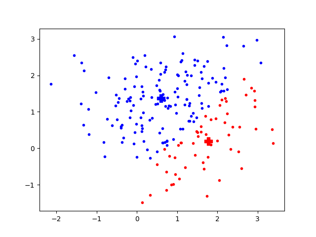

# It's our nature to see clustering patterns
Distribution of Subway restuarants (Source: https://i.insider.com/58337a73ba6eb6b1018b5a71
)

{width=90%}

# Clustering

1. An **un**supervised approach 
2. What to do: grouping samples into clusters, such that (usually) samples sharing similar properties belong to the same cluster
3. Clustering usually is not used as an end-to-end solution to a problem (e.g., classification or regression), but a step in a pipeline of data analytics. 
4. Applications: 
   * Data partitioning (e.g., separate background with foreground in IP/CV)
   * Data compression (e.g., many samples are compressed to one sample the represents them)
   * Data visualization (e.g., showing that the features selected or engineered make sense, [sklearn demo on Iris dataset](https://scikit-learn.org/stable/auto_examples/cluster/plot_cluster_iris.html#sphx-glr-auto-examples-cluster-plot-cluster-iris-py))
   * Simple but usually explanable classification (e.g., in combination with k-NN classifiers)
5. Approaches
   * centroid-based (e.g., k-means)
   * hierarchical/Agglomerative (e.g., linkage)
   * density-based (e.g., DBScan)

# k-means I 
- It was originated from signal processing. 
- A cluster is a set of samples. 
- k-means means $k$ clusters, whose means are called **centroids**. 
- Given a cluster $s_i$ which is a set of samples, its centroid is simply the arithmetic mean of all samples in $s_i$, i.e., 
  \begin{equation}
   c_i = {1\over |s_i|} \sum_{\mathbf{x}\in s_i} \mathbf{x}.
   \label{eq:centroid}
  \end{equation}
- The number $k$ is given by the user, empirically or arbitrarily. 
- The algorithm is not stable: it depends on random numbers. 
- It uses an iterative process. 
  a. Initially, $k$ samples are randomly picked as the centroids of their perspective clusters. 
  b. Assignment step: then scan every sample, and assigned it to the closest centroid. 
  c. Update step: For every cluster, recompute its centroid using Eq. \ref{eq:centroid}.  
- The algorithm stops after the centroids no longer changes. 
- Because the initial centroid choice matters, usually the algorithm run with different initial centroids and the one that minimizes a loss function is chosen at the end. 

# k-means II

- k-means starts with seed centroids. Then iterate to shift the centroids. This is called a **run** consisting of many **iterations**. 

- Assignment step. Given a sample $\x$, and a list of centroids $C$, the index of the cluster that $\x$ should be assigned to is $$i = \arg\min_{i} d(\x, \mathbf{c}_i), \forall \mathbf{c}_i\in C$$ where $d(\cdot)$ is the function to measure distance. In simplest form, it could be Euclidean distance where  $d(\x, \mathbf{c}_i) = || \x - \mathbf{c}_i||^2$. 

- In other words, a cluster $s_i = \{ \x | d(\x, \mathbf{c}_i) \le d(\x, \mathbf{c}_j), \forall j\in[1..k] \}$. 

- When to stop the iterations? 
  When the Frobenius norm (L2 norm on matrixes) of the difference in the cluster centers of two consecutive iterations falls below a pre-set tolerance, we decleart the convergence and stop. 

- The method just described above is called Naive k-means. There are many variants of it. 

- Let's see a demo `kmeans.py`

# Demo 

 

# K-means III: Hyperparameters

- $k$
- the tolerance to declare convergence and to stop iteration
- number of runs 

# Single-linkage clustering I 

- k-means has a major drawback: it ignores the gap between samples. 

- If you have a spoke-like distribution of data, you may prefer samples that resemble dot lines to belong to the same cluster. 

-  Hierarchical/Agglomerative clustering is to solve this problem. Here we just discuss one example, single-linkage clustering. 

- Instead of working on the distance from a sample to the centroid of a cluster, it focuses on the distance from a sample to the closest sample in a cluster. In this way, it has a great power to "connect the dots". 

- It works bottom up. Initially, every sample is a cluster.

- Then it enters into an iterative process. It evaluates the distances for all pairs of clusters. It then merges the closest pair. 

- The iterative process stops when there is only one cluster left, the entire dataset. 

- Note that the inter-cluster distance is re-evaluated at each iteration. 

# Single-linkage clustering II
- Hold on. One cluster in the end? What if I want 2, 3, ..., clusters?

- The iterative process can be represented as a binary tree, called **dendrogram**. 

- Each tree node is associated with a value. The leaf nodes are the samples. Two nodes have the same parent if they merge into one cluster. The value for the parent node is the minimal distance between the child cluster. 

- To get $k$ clusters, just find a threshold value such that removing all nodes on the dendrogram whose value is greater than the threshold value will result in $k$ trees. Each of the remaining trees is a cluster. 

- Single-linkage clustering has a property: "the rich get richer."

- See the example on Wikipedia. https://en.wikipedia.org/wiki/Single-linkage_clustering#Working_example 

# Other clustering approaches
- Mean-shift
- DBSCAN (SIGKDD 2014 Test of Time Award)

# Reading materials

- https://scikit-learn.org/stable/modules/clustering.html

# One neuron/perceptron
::: {.columns}
:::: {.column width=0.4}

::::
:::: {.column width=0.6}

::::
::: 
