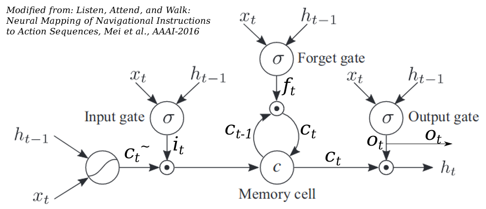

# 

Images that were not created by the instructor but from the web 
are cited in the Markdown source code in the syntax: 
```

```

# Deep learning (DL)

- Deep neural networks (DNNs): extensive amounts of layers. 


# Why is DL something relatively new? 

- DNNs use the same algorithms as any (shallow) ANNs: feedforward and backpropagation

- But DL needs two new sauces: "Big Data" and "Big Processor"

- Extensive amounts of layers means extensive amounts of transfer matrixes (weights) that need Big Data to train 

- It wasn't feasible until massive data was digitized (how many pictures were digital before iPhone?)

- Extensive amounts of layers also needs lots of computational power in training and prediction 

- It wasn't feasible until the raise of general-purpose graphic processing unit (GPGPU) computing 

- New techniques have been developed to speed up the training of DNNs and/or to avoid overfitting: [dropout](https://en.wikipedia.org/wiki/Dilution_(neural_networks)), [batch normalization](https://en.wikipedia.org/wiki/Batch_normalization), stochastic pooling, etc. They are used for other DNNs as well. 

# Deep learning: automated feature extraction

-   Conventional ML: manually craft a set of features in a process called **feature engineering**. 

-   Limitation: Sometimes features are too difficult to be manually
    designed, e.g., from I/O system log.

-   A (no-brainer) solution: let computers find it for us, even by
    brutal force.

-   Many DL tasks are end-to-end and hence are more black-box.


# Deep learning introduces new ways to use ANNs

-   There are more tasks that need function fitting beyond
    conventional classification and regression.

-   DL can be used to generate data (e.g, generating the translation of a sentence, turning a picture into Van Gogh style)

-   Sometimes we use the network to get something else useful, such
    as word embedding, but discard the network in the end.

-   Maybe weights of only a small set of layers are what we need
    from training.

-   Using DL requires creative ways to prepare training data (e.g., negative sampling), not  straightforward pairs of feature/input vectors and labels/output vectors).


# CNN, ConvNet, Convolutional Neural Networks

::: {.columns}
:::: {.column width=0.5}
-   Convolutional layers: 
    * [Convolution](https://en.wikipedia.org/wiki/Convolution) is a math operation that characterizes a signal (text, image, audio) using its spatial similarity with a template (called a **filter** in CNNs)
    * A CNN usually trains more than one filters, forming a **filter bank**. 
    * Conv layers are NOT fully connected. 

-   Pooling layers: downsample a matrix into one sample which contains the most useful information

-   ReLU layers: as activations, faster to train than $\tanh$ or logistic. 

-   Fully connected layer or dense layers (basically this is the regular ANN): usually toward  the end of a network. 

-   Softmax layers: common but not mandatory for output. 

::::

:::: {.column width=0.5}

-   Usual architecture: seveveral stacks of {conv, pool, Relu}, then several FC layers, finally/optionally softmax. 

-   Visualization of the output at layers: http://cs231n.github.io/convolutional-networks/

-   Too many hyperparameters (especially the size of filters and the stacking of layers). So some pre-configued architectures are commonly used, e.g., [AlexNet](https://en.wikipedia.org/wiki/AlexNet), VGGNet, [ResNet](https://en.wikipedia.org/wiki/Residual_neural_network). 

-   Applications: matrix-like data, images, audios, 3D scans, time series, etc. 

-   Filters trained for a task can be reused or fine-tuned for another task. (**transfer learning**)
::::
:::

# Hyperparameters of convolutional layers

See Tensorflow [Conv1D](https://www.tensorflow.org/api_docs/python/tf/keras/layers/Conv1D), [Conv2D](https://www.tensorflow.org/api_docs/python/tf/keras/layers/Conv2D), [Conv3D](https://www.tensorflow.org/api_docs/python/tf/keras/layers/Conv3D)

- How many filters, e.g., 32
- Dimensions of filters, e.g., 3x3
- strides: how many pixels to shift after one convolution. 1D if 1D conv, 2D if 2D conv.
- padding: to make use of samples around the edges [Ref](https://deepai.org/machine-learning-glossary-and-terms/padding)

# Additional resources about CNNs
- [A very informative presentation by Yann Le Cun at CERN in 2016](https://indico.cern.ch/event/510372/)

- [DeepVis, a CNN visualization tool by Jason Yosinski at ICML DL 2015](https://github.com/yosinski/deep-visualization-toolbox)

- [TF_CNNVis, a similar CNN visualization tool based on TF ](https://github.com/InFoCusp/tf_cnnvis)

- https://towardsdatascience.com/how-to-visualize-convolutional-features-in-40-lines-of-code-70b7d87b0030

# Recurrent Neural Networks (RNNs)
::: {.columns}
:::: {.column width=0.6}

- Very often, the output of a system that we want to model depends partially on the previous output. E.g., next-word prediction or machine translation. 

- RNNs is the kind of networks. "recurrent" means using the same information again. 

- An RNN's input has two parts: $\mathbf{x}_t$, the "fresh" input at step $t$, and $\mathbf{o}_{t-1}$ the output at previous step $t-1$. 

<!-- They are transformed into a hidden representation $\mathbf{h}_t$ via two respective transfer matrixes: $\mathbf{h}_t=\mathbb{U}\mathbf{x}_t + \mathbf{W}\mathbf{o}_{t-1}$  -->

- Unrolling/unfolding an RNN unit:
  

::::
:::: {.column width=0.4}
 
<!-- - (Many papers use $\mathbf{h}$ (short for "hidden") for $\mathbf{o}$ in the equation/figure left). -->

- Examples: Elman network [1](https://web.stanford.edu/group/pdplab/pdphandbook/handbookch8.html) [2](http://mnemstudio.org/neural-networks-elman.htm), [Hopfiled Network](https://en.wikipedia.org/wiki/Hopfield_network)

- An RNN is just an IIR filter (are you also a EE major?):
    $$y[n] = \sum_{l=1}^N a_l y[n-l] + \sum_{k=0}^{M} b_k x[n-k]$$ where
    $x[i]$ (or $y[i]$) is the $i$-th element (a scalar) in the input (or
    output) sequence.
::::
:::

# LTSM and GRU networks: two special kind of RNNs
<!-- ::: {.columns}
:::: {.column width=0.6} -->
- Vanilla (basic, plain) RNNs are not good at modeling long-term dependencies which is especially common in text. E.g., in the sentence, "Unlike what he said, I did NOT eat the pizza", "Unlike" and "not", two words separated far, need to be jointly considered to infer whether the subject ate the pizza. 

- A solution is to maintain a state. E.g., when "unlike" is scanned, set a state, later use that state to double-negate "eat" with "not". Reset the state after "not" is scanned.

- Hence LSTM (an architecture) was invented. Another motiviation is that gradient vanishing is significant for a deep RNN. 

- [Gated Recurrent Unit (GRU)](https://en.wikipedia.org/wiki/Gated_recurrent_unit): simpler, just reset gate and update gate.

# LSTM gates 
An LSTM neuron is a **cell** or **unit**. Each LSTM cell has 3 **gates**: forget gate, input gate, and output gate. The 3 gates are all
        computed from current input $\mathbf{x}(t)$ and hidden state vector (NOT output) from
        previous time-step $\mathbf{h}(t-1)$, but with different transfer matrixes/weights. 


::: {.columns}
:::: {.column width=0.7}
{width=100%}
::::

:::: {.column width=0.3}
\begin{align*}
f_t &= \sigma_g(W_{f} x_t + U_{f} h_{t-1} + b_f) \\
i_t &= \sigma_g(W_{i} x_t + U_{i} h_{t-1} + b_i) \\
o_t &= \sigma_g(W_{o} x_t + U_{o} h_{t-1} + b_o) \\
\tilde{c}_t &= \sigma_c(W_{c} x_t + U_{c} h_{t-1} + b_c) \\
c_t &= f_t \circ c_{t-1} + i_t \circ \tilde{c}_t \\
h_t &= o_t \circ \sigma_h(c_t)
\end{align*}
::::
:::

Note that the activation functions $\sigma_g, \sigma_c, \sigma_h$ may not all be the same. Usually $\sigma_c$ and $\sigma_h$ are $\tanh$ and gate activations are logistic. 

# Units vs. Layers

- Each LSTM unit at a time-step produces one scalar output ($o_t$). Some ML frameworks allow returning the outputs (e.g., `return_sequences` in `tf.keras.layers.LSTM`) at all time-steps, hence a sequence. 

- To train an LSTM unit, a sample is usually a sequence of inputs, each of them matches one time-step $t$. 

- Depending your application, you may parallelize several units together. They run independently and "remember" different things. E.g., to predict the stock price of more than two companies. [See demo](https://colab.research.google.com/drive/1wl-5uofsShYJic0KQ5zapku_l8dHeJR2#scrollTo=QLnZp5Ia5ooR)

- You could also stack LSTM layer along time-steps so your network can PROBABLY "remember" more complex things, e.g., [Lattic GRU](https://arxiv.org/pdf/1710.02254.pdf) or context-dependent language models in NLP. It differs from giving longer input sequences.  

- The term "cell" in literature is a unit. But in many ML frameworks, including [Tensorflow](https://www.tensorflow.org/api_docs/python/tf/compat/v1/nn/rnn_cell/RNNCell?hl=id), it could mean a layer of units. 

# Additional information about LSTM 
  * [Time series prediction from Tensorflow tutorial](https://www.tensorflow.org/tutorials/structured_data/time_series)
  * http://www.wildml.com/2015/10/recurrent-neural-network-tutorial-part-4-implementing-a-grulstm-rnn-with-python-and-theano/
  * http://colah.github.io/posts/2015-08-Understanding-LSTMs/


# Neural language models in Elman network

-   A language model predicts the Probability of a sequence
    of (words, characters, etc. )

-   Because of the properties of conditional probability, we want the
    probability of next word, given a short history of the sequence:
    $P(w_{t+1} | w_{i}, i\in [t-k..t])$

-   Elman network/simple RNN. Three layers:

    -   Input layer is the concatenation $\mathbf{x}(t)$ of two parts:
        the current **sequence** (not just one element!!!)
        $\mathbf{w}(t) = [w_{t-k}, \dots, w_{t}]$, plus output from the
        hidden layer in previous step $\mathbf{s}(t-1)$.

    -   hidden/context layer:
        $\mathbf{s}(t) = f\left( \mathbb{X} \mathbf{x}(t) \right)$ where
        $\mathbb{X}$ is the matrix of weights from the input layer to
        hidden layer.

    -   Output layer: multiple neurons, one of which of the highest
        activation corresponds to the best prediction. Each neuron
        corresponds to one element in the sequence, e.g.,
        word/character/etc.

-   The new language model:
    $P(w_{t+1} | \mathbf{w}(t), \mathbf{s}(t-1)),$ predicting the next
    output word given a short history $\mathbf{w}(t)$ up to current step
    $t$ and the hidden layer up to previous step $t-1$.

# Neural language models -- additional reading 

-   Feedforward: "A neural Probabilistic Language Model", Beigio et al.,
    JMLR, 3:1137--1155, 2003

-   "Recurrent neural network based language model", Mikolov et al.,
    Interspeech 2010

-   Multiplicative RNN: "Generating Text with Recurrent Neural
    Networks", Sutskever, ICML 2011

# Seq-to-seq learning

- Can RNNs be used to predict the future? 

- DL can be used to generate data, e.g., machine translation. 

- A set of approaches belong to sequence-to-sequence (seq-to-seq) learning. 

- Two RNNs: encoder and decoder, the former encodes sequantial inputs into information hidden in weights of an NN while the latter generates outputs, usually one each timestep, based on the hidden information. [See "I am a student" figure in Tensorflow NMT tutorial](https://www.tensorflow.org/tutorials/text/nmt_with_attention)

- "Learning Phrase Representations using RNN Encoder--Decoder for
    Statistical Machine Translation", Cho et al., EMNLP 2014

- Other applications: seizure prediction, speech recognition or synthesis, e.g., [Boss Wang et al., 2017, Tacotron: Towards End-to-end Speech Synthesis](https://arxiv.org/pdf/1703.10135.pdf)

# Autoencoders: representation learning

- Let's bring DL-based generation to another level: can we re-produce the input data from the output layer? 


- Applications: data compression. More applications: image deblurring. Lots of illegal things: courterfeit signatures/voices (don't worry, we will talk about how to catch them in GANs)

# Generative adversarial networks (GANs)

- A GAN has two NNs: generator and discriminator/classifier. They push the limit of each other to find the essence of data. 

[See Google's tutorial](https://developers.google.com/machine-learning/gan/gan_structure)


# Embedding

- Many objects (e.g., words, categories) are discrete. Not suitable for NNs. [See Block2Vec](https://webpages.uncc.edu/ddai/papers/dong-icppw-16.pdf)
- Embedding uses a vector of floats to represent a discrete object. Ideally, similar objects, e.g., "cat" and "tiger" have similar vectors, whereas irrelavant objects, e.g., "cat" and "hat" have orthorgonal vectors. 
- An embedding layer is a look-up table, initially random. [See demo](https://colab.research.google.com/drive/15repLULKxghG5FYIeBbxoL-47JyGoRXI#scrollTo=Bu8IhewrNwcr)
- Embeddings are obtained by backpropagation from downstream tasks. 
- Word embedding (static): [Word2vec](https://github.com/tensorflow/docs/blob/master/site/en/r1/tutorials/representation/word2vec.md), [GloVe](https://nlp.stanford.edu/projects/glove/)

- How to create a downstream task for word embedding? Negative sampling in CBOW and skip-gram. 

- Dynamic/contextual word embedding: [AI$^2$ Elmo, biLSTM](https://allennlp.org/elmo), [Transformer, encoder-decoder](https://www.tensorflow.org/tutorials/text/transformer), [OpenAI GPT](https://openai.com/blog/better-language-models/). 

- Sentence embedding: [Google Universal Sentence Encoder](https://tfhub.dev/google/universal-sentence-encoder/4), [Google BERT](https://en.wikipedia.org/wiki/BERT_(language_model)), [Facebook InferSent]

- See also: 
  https://www.tensorflow.org/api_docs/python/tf/keras/layers/Embedding


# Further readind on word and sentence embedding
- [Generalized Language Models by Lilian Weng](https://lilianweng.github.io/lil-log/2019/01/31/generalized-language-models.html)
- https://stats.stackexchange.com/questions/421935/what-exactly-are-keys-queries-and-values-in-attention-mechanisms
- [Deconstructing BERT, Part 2: Visualizing the Inner Workings of Attention, by Jesse Vig](https://towardsdatascience.com/deconstructing-bert-part-2-visualizing-the-inner-workings-of-attention-60a16d86b5c1)
- [Implementing Transformer in Tensorflow, by Tensorflow team](https://www.tensorflow.org/tutorials/text/transformer)
- [Implementing Transformer in PyTorch, by Harvard NLP](http://nlp.seas.harvard.edu/2018/04/03/attention.html)

# Transfer learning 

- Multitask learning
- [Long et al., Conditional Adversarial Domain Adaptation,  NIPS 2018](https://arxiv.org/pdf/1705.10667.pdf)


# Frameworks

There are [several DL frameworks](https://en.wikipedia.org/wiki/Comparison_of_deep-learning_software):

- Tensorflow (Keras), PyTorch, Flux, MXnet
- No longer active dev: Torch, Theano
- They share similar UI, e.g., Torch's [layer stacking](https://en.wikipedia.org/wiki/Torch_(machine_learning)#nn) is very similar to that of Keras. 
- ONNX 

# DL on small devices
- DL is cool. But a DNN easily involve hundreds of thousands of parameters. How to pack them into a device of only a few MB of memory and powered by a battery?
- Solution 1, specific hardware/co-processor, mostly are for vision tasks: [Google Coral Edge TPU](https://coral.ai/docs/edgetpu/faq/), Intel Movidius, [ARM Ethos (UK)](https://developer.arm.com/ip-products/processors/machine-learning/arm-ethos-n), [Ambarella CVFLow](https://www.ambarella.com/technology/), [nVidia Tegra with CUDA (see also Jetson)](https://en.wikipedia.org/wiki/Tegra#Xavier), [QualComm Zeroth](https://www.qualcomm.com/news/onq/2013/10/10/introducing-qualcomm-zeroth-processors-brain-inspired-computing), [Cambricon (China)](http://www.cambricon.com/), [Huawei NPU in Kirin (China)](https://consumer.huawei.com/en/campaign/kirin980/)
- Using special hardware for operations like convolution is not new. [DSPs](https://en.wikipedia.org/wiki/Digital_signal_processor) have been there for decades, e.g.,  [TI TMS320](https://www.ti.com/processors/digital-signal-processors/overview.html). 
- Solution 2, tailored libraries: 
  * [Google Tensorflow Lite](https://www.tensorflow.org/lite), [its supported microcontrollers](https://www.tensorflow.org/lite/microcontrollers), and [an example on Arduino Nano 33 Sense](https://blog.arduino.cc/2019/10/15/get-started-with-machine-learning-on-arduino/)
  * [Google MobileNet](https://arxiv.org/pdf/1704.04861.pdf)
- Solution 3, a new math:
  * quantization/integer neural networks [1 by Mathworks](https://www.mathworks.com/company/newsletters/articles/what-is-int8-quantization-and-why-is-it-popular-for-deep-neural-networks.html) [2 by QualComm](https://www.qualcomm.com/news/onq/2019/03/12/heres-why-quantization-matters-ai)
  * analog neural networks: [Hopfield 1990](https://www.tandfonline.com/doi/abs/10.1088/0954-898X_1_1_003?journalCode=inet20), [IBM Analog AI using phase-change memory](https://analog-ai-demo.mybluemix.net/hardware)
- "Cross training" (compared to cross-compilation): train on the cloud/workstation and predict on the edge, e.g., [Amazon DeepLens](https://aws.amazon.com/deeplens/)