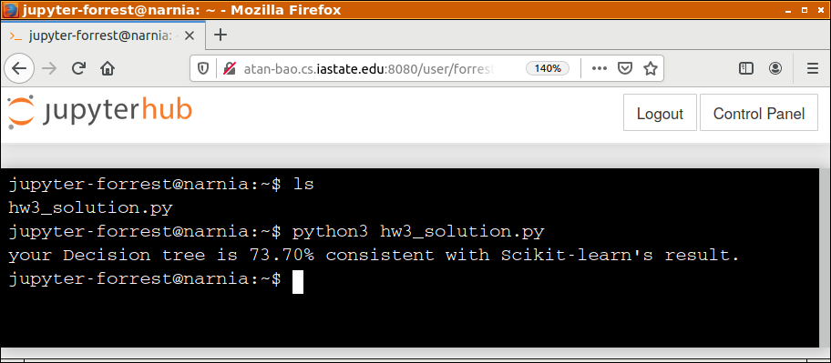

# How to use Jupyter Hub 

If you run into issues, [create a ticket here](https://github.com/forrestbao/MLClass/issues) 
The instructor and the TAs will assist you. 
You are also more than welcome to help the entire class by editing this user guide and creating pull requests. 

## 0. Networking
First connect to ISU VPN or connect to a network on campus. 
Then open http://atan-bao.cs.iastate.edu:8080 in your web browser. 

## 1. Usernames and passwords
Upon open the link above, you will see a login page.
Your username is your firstname.lastname (**lower case**) as they appear on Canvas. If you have trouble, please email the TA Roger Ge Luo. 
Create a password for yourself. Since you only enter it once, and keystrokes are replaced with asterisks immediately, enter carefully and remember it. 

If you see a Launch Server page like below, just click `Launch Server`. 

## 2. Uploading your scripts (`.py` or `.ipynb`)
Upon login, your Jupter Server shall start automatically presenting you an interface below. 

You may upload your scripts by clicking the `Upload` button. 
Files uploaded will appear to the left, like `hw3_solution.py`
You can upload either `.py` scripts or `.ipynb` notebooks. 

## 3. Using `.ipynb` Jupyter/IPython Notebooks

For a Jupyter/Ipython notebook, click the file link shall open it. And you can edit and execute each cell as on your own computer. 

For how to run `doctest` in IPython notebook, see [this notebook](./doctest_demo.ipynb) 

## 4. Running `.py` Python scripts
To run a `.py` script, in the interface above, click the `New` button, and then `Terminal` on the pull-down menu. 

A UNIX shell shall open for you in a newly opened/popped webpage. First, run `ls` to see whether the file is there. 
Then, you can run it. You can even use `nano` or `vim` to edit it. 

## 5. Create new Python script or Jupyter/IPython notebooks

You may also directly create files on the Jupyter server. Just click the `New` button in Section 2 above and select the proper options. 

## 6. If your server crashes

Go to the interface in Section 2. Click `Control Panel` to restart your server. 
Don't be afraid of impacting the whole class. It only restarts your own virtual Jupyter server. 

## 7. Advanced usages

You can, even connect to the server via remote tools, such as `ssh` or [Remote Development extension pack](https://marketplace.visualstudio.com/items?itemName=ms-vscode-remote.vscode-remote-extensionpack) of Microsoft VS Code. 
The username is `jupyter-{firstname}.{lastname}` while the password is the one you set up in Section 1. 

## $\infty$. Lastly, do not do bad things on this server. 
